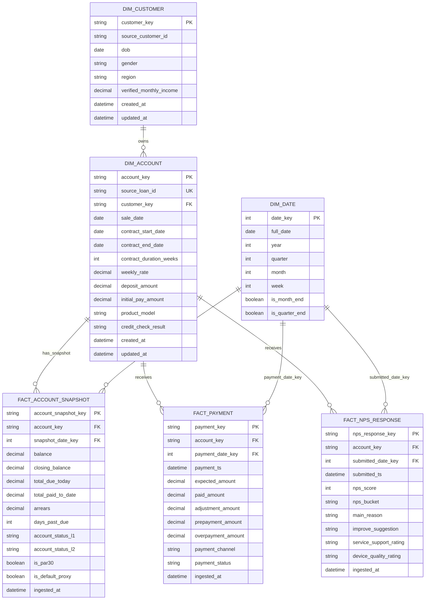
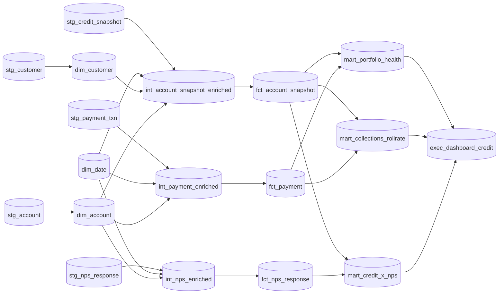

# MoPhones Repeatable Reporting Data Model (Sketch)

Below is a lightweight **ERD + analytics DAG sketch** for reliable credit-risk and customer-experience reporting.

---

## 1) Logical ERD (source-aligned warehouse model)

### Why this works
- **Customer → Account → Snapshot/Payment/NPS** enables both lifecycle and point-in-time reporting.
- Separate facts prevent duplication and allow clean metric definitions:
  - delinquency from `fact_account_snapshot`
  - cashflow/consistency from `fact_payment`
  - customer sentiment from `fact_nps_response`
- `dim_date` standardizes time-series logic across all marts.

---

## 2) dbt-style DAG (reporting layer)

### Brief annotations
- `stg_*`: source cleaning, type casting, column normalization, de-duplication.
- `int_*`: business-rule application (default proxy, PAR flags, tenure bands, nps buckets).
- `fct_*`: conformed atomic facts with surrogate keys.
- `mart_*`: KPI-ready reporting tables for portfolio, collections, and credit×experience views.

---

## 3) Minimum governance for repeatability
- **Metric contracts**: centrally define PAR30, default, repayment rate, active/closed ratio.
- **Status dictionary**: controlled mappings for `account_status_l1/l2`.
- **Freshness tests**: snapshot timeliness and row-count anomaly checks.
- **Key integrity tests**: `source_loan_id` uniqueness, FK coverage from facts to dimensions.

